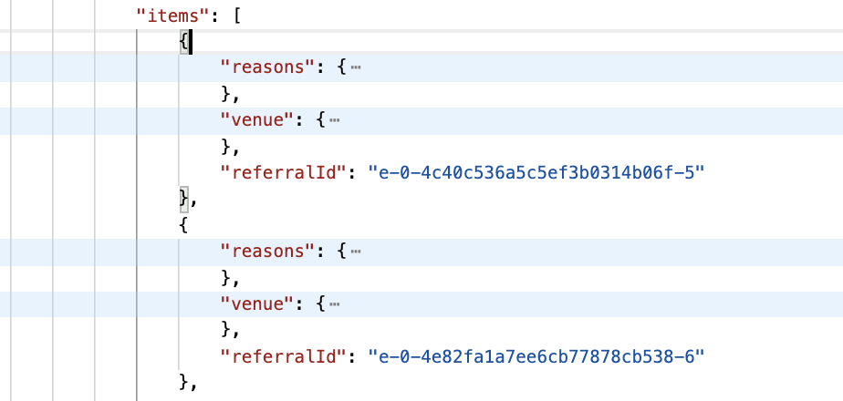

### Todo
- [x] try out foursquareAPI on Postman
- [x] setup venue json object
- [x] implement fetching data
- [x] implement icon image caching
- [x] make a draft of view constraints
- [x] create storyboard
- [x] populate results
- [x] add a navigation bar please!!
- [x] fetch next results
- [x] add something to launchscreen
- [x] add a loading alert when app is fetching current location
- [x] make app icon
- [x] clean up
- [x] All done 🎉🎉

### Initial planning
**Reading Foursquare API**
- [correctly query offset](https://stackoverflow.com/questions/8526798/foursquare-venue-api-number-of-results-in-a-more-efficient-way)
- [parameters](https://developer.foursquare.com/docs/api-reference/venues/explore/#parameters)
- [getting photo file](https://developer.foursquare.com/docs/api-reference/venues/photos/)

**Testing with Postman's Foursquare collection**
<table>
<tr>
	<td>
		 
		json object = swift dictionary `[String:Any]`
	</td>
	<td>
		 
		Array of json object = swift array of dictionary `[[String:Any]`
	</td>
	<td>
		 
		Venue is a json object, we need 2 type of things from venue
		1. properties from location object
		2. properties in icon, which is inside categories of type `[[String:Any]]` we only want to get the one with primary value = true
	</td>
<tr>
</table>

**Drafts**
<table>
<tr>
	<td>
		
	</td>
	<td>
		
	</td>
<tr>
</table>

**Other main resources**
- [getting current location]( https://developer.apple.com/documentation/corelocation/getting_the_user_s_location/using_the_significant-change_location_service)
- [about fetching nested json](https://developer.apple.com/swift/blog/?id=37)
- [activity view](https://www.hackingwithswift.com/example-code/uikit/how-to-use-uiactivityindicatorview-to-show-a-spinner-when-work-is-happening)

### Screenshots
<table>
<tr>
	<td>
		
	</td>
	<td>
		
	</td>
</tr>
</table>

 
